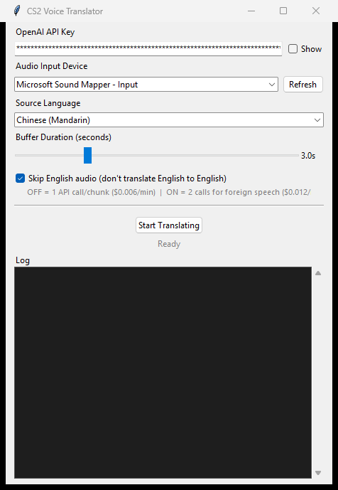

# CS2 Real-time Voice Translation

Real-time voice translation overlay for CS2 (Counter-Strike 2) that translates foreign-language teammates to English using the OpenAI Whisper API.

## Features

- **Non-intrusive overlay** — transparent, draggable window that sits on top of CS2
- **Cloud-powered** — uses OpenAI Whisper API, no GPU required
- **VAC-safe** — no game process injection, just a display overlay
- **Near real-time** — captions arrive after the buffer duration (3 s by default) plus the API round trip
- **Multi-language** — Whisper detects the spoken language automatically (Chinese, Japanese, Korean, Russian, Spanish, French, German, and more)
- **Smart filtering** — optionally skips English audio to save API costs
- **Desktop app with GUI** — settings window with audio device picker and live log panel
- **Secure** — API key stored in Windows Credential Manager, not in files
- **WASAPI loopback** — capture speaker/headphone output directly, no virtual cable needed

## Requirements

- Windows 10/11
- Python 3.10+
- OpenAI API key ([get one here](https://platform.openai.com/api-keys))
- Internet connection

## Installation

```bash
# Clone the project
git clone https://github.com/danialothman/cs2-translator.git
cd cs2-translator

# Create virtual environment
python -m venv .venv
.venv\Scripts\activate

# Install dependencies
pip install -r requirements.txt
```

## Usage

```bash
python app.py
```

The settings window opens where you can:

<p align="center">
  
</p>

1. **Enter your OpenAI API key** (stored securely in Windows Credential Manager)
2. **Select an audio device** — pick your speakers/headphones as a loopback device to capture game audio, or a microphone for direct input
3. **Adjust buffer duration** — shorter = faster but less context, longer = more accurate
4. **Toggle "Skip English"** — prevents translating English-to-English
5. Click **Start Translating**

You do not need to pick a source language. Whisper detects it for each audio chunk.

The overlay appears on top of your game showing timestamped translations. Drag it to reposition.

## API Costs

The app uses the OpenAI Whisper API which costs **$0.006 per minute** of audio.

| Mode | Cost | Notes |
|------|------|-------|
| Skip English OFF | ~$0.006/min | Single API call per chunk, translates everything |
| Skip English ON | ~$0.012/min for foreign speech | Two calls (detect language + translate); English chunks cost one call |

A typical CS2 session costs well under $1.

## Configuration

All settings are configured through the GUI and persisted in `%APPDATA%\CS2Translator\settings.json`. The API key is never written to this file. Available options:

- **Audio device** — any input device or speaker loopback
- **Buffer duration** — 2-6 seconds of audio per chunk
- **Skip English** — avoid translating English speech

## Troubleshooting

### No audio devices in dropdown
- Click **Refresh** to re-scan devices
- Make sure your audio device is connected and enabled in Windows Sound Settings

### "Invalid API key" error
- Verify your key at [platform.openai.com/api-keys](https://platform.openai.com/api-keys)
- Make sure you have credits loaded on your account

### Overlay doesn't stay on top
- Run Python as administrator
- Use **borderless windowed** mode in CS2 (not exclusive fullscreen)

### Translations are slow
- Reduce buffer duration (2-3 seconds)
- Check your internet connection
- If the log shows "Translation is falling behind; dropped a stale audio chunk", the API is slower than the audio. The app drops old audio to keep captions current. Turn off "Skip English" to halve the API calls per chunk.

### "Rate limited by OpenAI" error
- The message after the colon comes from OpenAI. If it mentions quota, add credits to your OpenAI account.

### Hallucinated translations (e.g. "Thank you for watching")
- This is a known Whisper issue with silence/noise — common hallucinations are filtered automatically
- If it persists, try increasing the buffer duration

## Privacy

The app sends captured audio, including your teammates' voices, to OpenAI for translation. It sends nothing while translation is stopped. OpenAI's API data usage policy governs how it handles that audio.

## Is This Bannable?

**No.** This tool:

- Does not inject code into CS2
- Does not modify game files
- Does not access game memory
- Only displays a window overlay (same as Discord overlay, MSI Afterburner, etc.)

## File Structure

```
cs2-translator/
├── app.py              # Entry point
├── settings_window.py  # GUI settings and control window
├── overlay.py          # Translation overlay display
├── translator.py       # OpenAI Whisper API integration
├── audio_capture.py    # Audio device enumeration and capture
├── config_manager.py   # Settings persistence (JSON + keyring)
├── docs/               # README screenshots
├── requirements.txt    # Python dependencies
├── build.py            # PyInstaller build script
├── NEXT.md             # Pending work and roadmap
├── DECISION.md         # Append-only log of design decisions
├── CLAUDE.md           # Guidance for Claude Code
└── .github/workflows/  # Windows .exe build and release on version tags
```

## Credits

- [OpenAI Whisper API](https://platform.openai.com/docs/guides/speech-to-text) for speech translation
- [PyAudioWPatch](https://github.com/s0d3s/PyAudioWPatch) for WASAPI loopback support

## License

MIT License — free to use and modify
